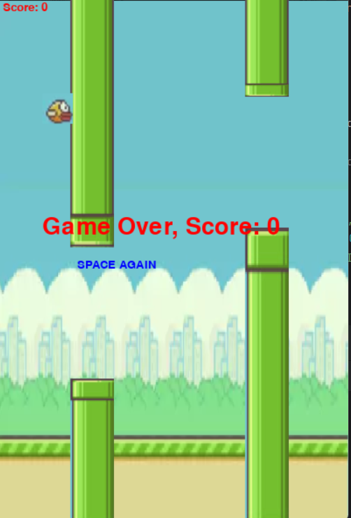

# Flappy Bird Game

Phát triển một trò chơi dạng Flappy Bird sử dụng thư viện Pygame, cho phép người chơi điều khiển một chú chim vượt qua các ống cản.

## Tính năng chính:

- **Vật lý cơ bản (trọng lực, lực bay):** Xử lý trọng lực và lực bay để điều khiển chú chim.
- **Sinh ống ngẫu nhiên và di chuyển liên tục:** Ống sẽ được sinh ra ngẫu nhiên và di chuyển từ phải sang trái.
- **Cơ chế ghi điểm:** Người chơi sẽ ghi điểm khi chú chim bay qua các ống mà không bị va chạm.
- **Giao diện bắt mắt:** Sử dụng ảnh nền và hình ảnh động để tạo giao diện sinh động.
- **Trạng thái trò chơi:** Bao gồm các trạng thái như bắt đầu, đang chơi, tạm dừng và kết thúc.

## Kết quả đạt được:

- **Hiểu rõ quy trình phát triển một game 2D đơn giản:** Phát triển toàn bộ trò chơi từ khởi tạo, quản lý sự kiện cho đến các tình huống va chạm.
- **Củng cố kiến thức về vòng lặp sự kiện, xử lý hình ảnh và va chạm trong Pygame:** Áp dụng các khái niệm cơ bản về lập trình game.
- **Nâng cao khả năng tổ chức mã nguồn và xử lý logic trò chơi:** Tổ chức mã nguồn rõ ràng và dễ bảo trì.

## Cấu trúc dự án

- **images/**: Chứa các hình ảnh liên quan đến giao diện game.
- **FlappyBird.ipynb**: Notebook chính của trò chơi.
- **README.md**: Mô tả dự án này.

## Giao diện Game

## Cách chạy

1. Tải mã nguồn về từ GitHub.
2. Mở file `FlappyBird.ipynb` trong Jupyter Notebook.
3. Chạy từng ô mã để chơi game.

